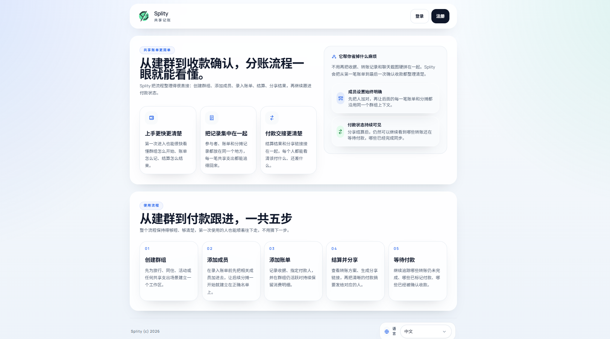

# Splity

Splity 是一个面向真实分账流程的 shared expense workspace。它把「创建群组 -> 添加成员 -> 添加账单 -> 打开结算 -> 分享付款信息 -> 等待付款确认」串成一条清晰流程，适合聚餐、旅行、同住和小团队共同消费场景。


## 项目简介

当前仓库包含：

- `apps/frontend`: React + TypeScript + Vite 前端
- `apps/backend`: ASP.NET Core 10 Minimal API + EF Core 后端
- `packages/api-client`: 前后端共享的 typed API client

## 主要功能

### 账户与入口

- 注册 / 登录
- Remember me 本地会话持久化
- Forgot Password 通过 SMTP 发送临时密码
- Settings 集中管理名字、密码、邮箱验证和登出

### 群组工作流

- 创建群组
- 群组列表按 `Current Groups / Settled Groups` 分类
- Group Overview 展示当前群组摘要
- Participants 通过 modal 批量添加
- Bills 通过 modal 创建、编辑和预览
- Bill item 的 `Responsible` 支持多人选择，默认平均分摊

### 结算与分享

- Settlement 在 `未落实` 时先显示明确提示和下一步入口
- 点击 `结算账单` 后群组进入 `结算中`
- Share bill modal 使用分步流程：
  - Step 1: 根据 settlement 结果自动列出每个 receiver，并可选填写付款信息
  - Step 2: 创建或查看当前群组唯一有效的分享链接
- 已存在分享记录时会复用之前保存的链接和付款信息
- 支持重新生成链接，旧链接失效，新链接取代旧链接
- 分享页 `/s/:shareToken` 仍显示详细结算内容
- 群组为 `已结算` 时，分享页仍可查看，但不提供付款或确认操作

## 群组状态规则

- `未落实 / unresolved`
  - 可编辑
  - 可新增 / 编辑 / 删除成员和账单
- `结算中 / settling`
  - 只读
  - 由用户手动点击 `结算账单` 进入
  - Participants / Bills / Settlement 只可查看
- `已结算 / settled`
  - 只读
  - 必须由用户手动点击 `已结算`
  - 不会自动变化

## 主要页面与使用流程
可以在 [screenshots](./screenshots) 文件夹中找到截图。

### 1. Home

- 未登录用户默认落地页
- 介绍产品价值、核心功能和 5 步使用流程
- header 只保留登录、注册

### 2. Auth

- 登录 / 注册共用页面
- 支持 Remember me
- Forgot Password 支持输入邮箱、统一成功提示、60 秒重发倒计时 （未实现，没有SMTP配置，仅做了模拟）

### 3. Dashboard

- 进入后先看到新手 5 步流程
- Overview 支持 `本月 / 本年` 筛选
- 显示：
  - 当前群组数量
  - 已结算群组数量
  - 创建账单数

### 4. Groups / Group Overview

- 左侧 Nav 显示当前用户真实群组数据
- 默认进入群组后先显示 Overview
- Overview 展示成员数、账单数、总金额、状态、结算概况等当前群组数据

### 5. Participants

- 添加成员改为 modal
- 一行一个输入框，支持动态增删
- `结算中 / 已结算` 只读

### 6. Bills

- 创建、编辑、预览都在 modal 中完成
- 表单默认空白，没有示例预填
- 支持 Responsible 多选
- `结算中 / 已结算` 只读

### 7. Settlement

- `未落实` 时不会直接显示完整结算结果，而是先显示提醒与下一步入口
- `结算中 / 已结算` 时显示正常结算页面
- 分享链接入口在这里打开 step flow modal

### 8. Settings

- 编辑名字
- 主动修改密码
- 邮箱验证状态与验证码流程
- 登出并清理本地会话，返回 Home

## 语言切换

- 仅支持 `zh / en`
- 语言切换入口统一在 footer dropdown
- Home、Auth、Dashboard、Groups、Settings、Settlement、分享页都使用同一套 i18n
- 用户语言选择会持久化，刷新后保留上次选择

## 环境变量说明

### Frontend

前端主要使用：

- `VITE_API_BASE_URL`

示例：

```env
VITE_API_BASE_URL=http://localhost:5204
```

### Backend

后端常用配置可通过 `appsettings*.json` 或环境变量覆盖。

#### 数据库

- `ConnectionStrings__DefaultConnection`
- `Database__Provider`

当前默认开发配置使用 MySQL。

#### JWT

- `Jwt__Issuer`
- `Jwt__Audience`
- `Jwt__Secret`

#### CORS / Frontend

- `Frontend__AllowedOrigins__0`
- `Frontend__AllowedOrigins__1`

#### SMTP

Forgot Password 和邮箱验证都依赖 SMTP。不要把 SMTP 凭据写死进仓库，请通过环境变量提供：

- `Smtp__Host`
- `Smtp__Port`
- `Smtp__EnableSsl`
- `Smtp__Username`
- `Smtp__Password`
- `Smtp__FromAddress`
- `Smtp__FromName`

示例：

```env
Smtp__Host=smtp.example.com
Smtp__Port=587
Smtp__EnableSsl=true
Smtp__Username=no-reply@example.com
Smtp__Password=your-password
Smtp__FromAddress=no-reply@example.com
Smtp__FromName=Splity
```

## Forgot Password 邮件依赖说明

- 前端始终显示统一提示：`如果邮箱存在，已发送重置邮件`
- 后端不会泄露邮箱是否存在
- 如果邮箱存在：
  - 生成随机临时密码
  - 使用现有密码哈希机制更新数据库密码
  - 通过 SMTP 发邮件
- 如果 SMTP 发信失败：
  - 后端会记录日志
  - 前端显示可理解的失败提示
  - 不暴露后端内部异常细节

如果没有正确配置 SMTP，Forgot Password 和邮箱验证邮件都无法真正发送。

## 本地运行方式

### 环境要求

- Node.js + npm
- .NET SDK 10
- MySQL

### 安装前端依赖

```powershell
npm run install:frontend
```

### 启动 frontend

```powershell
npm run dev:frontend
```

默认地址：

- `http://localhost:5173`

### 启动 backend

```powershell
npm run dev:backend
```

默认地址：

- API: `http://localhost:5204`
- Health check: `http://localhost:5204/health`

### 同时启动前后端

```powershell
npm run dev
```

## 构建命令

```powershell
# frontend build
npm run build:frontend

# backend build
npm run build:backend

# full build
npm run build
```
