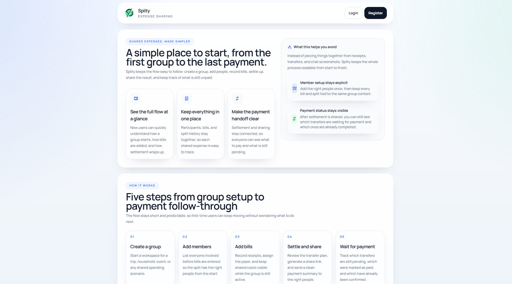

# Splity

Splity is a shared expense workspace built around a real bill-splitting flow. It connects "create a group -> add members -> add bills -> open settlement -> share payment details -> wait for payment confirmation" into one clear path, and fits group dinners, trips, shared living, and small team spending.


## Project Overview

This repository currently contains:

- `apps/frontend`: React + TypeScript + Vite frontend
- `apps/backend`: ASP.NET Core 10 Minimal API + EF Core backend
- `packages/api-client`: shared typed API client used by both frontend and backend

## Main Features

### Account and Entry Flows

- Register / login
- Local session persistence with Remember me
- Forgot Password sends a temporary password through SMTP
- Settings centralizes profile name, password, email verification, and sign-out

### Group Workflow

- Create groups
- Group list is split into `Current Groups / Settled Groups`
- Group Overview shows a summary of the current group
- Participants supports batch add via modal
- Bills supports create, edit, and preview via modal
- Bill item `Responsible` supports multiple people and splits equally by default

### Settlement and Sharing

- When a group is still `unresolved`, Settlement first shows a clear prompt and next-step entry instead of the normal settlement result view
- Clicking `Settle bills` moves the group into `settling`
- The Share bill modal uses a step flow:
  - Step 1: automatically lists each receiver from the settlement result and lets you optionally fill in payment info
  - Step 2: creates or shows the single active share link for the current group
- If a share record already exists, the modal reuses the previously saved link and payment info
- Regenerating is supported: the old link becomes invalid and the new link replaces it
- The share page `/s/:shareToken` still shows detailed settlement content
- When a group is `settled`, the share page remains viewable but no longer allows payment or confirmation actions

## Group Status Rules

- `unresolved / 未落实`
  - Editable
  - Participants and bills can be created, edited, and deleted
- `settling / 结算中`
  - Read-only
  - Entered manually by clicking `Settle bills`
  - Participants / Bills / Settlement are view-only
- `settled / 已结算`
  - Read-only
  - Must be entered manually by clicking `Mark as settled`
  - Never changes automatically

## Main Pages and Usage Flow

Screenshots are available in the [screenshots](./screenshots) folder.

### 1. Home

- Default landing page for unauthenticated users
- Introduces product value, key features, and the 5-step usage flow
- Header only keeps login and register

### 2. Auth

- Shared page for login and registration
- Supports Remember me
- Forgot Password supports entering an email, shows a generic success message, and provides a 60-second resend countdown (not fully implemented without SMTP config; currently only simulated)

### 3. Dashboard

- Shows the onboarding 5-step flow first
- Overview supports `This month / This year`
- Displays:
  - Current group count
  - Settled group count
  - Bills created count

### 4. Groups / Group Overview

- Left navigation shows real groups for the current user
- Entering a group lands on Overview by default
- Overview shows current-group data such as participant count, bill count, total amount, status, and settlement summary

### 5. Participants

- Add participants through a modal
- One input per line, with dynamic add/remove rows
- Read-only in `settling / settled`

### 6. Bills

- Create, edit, and preview are all handled in a modal
- Forms are blank by default, with no demo prefill
- Supports multiple Responsible selections
- Read-only in `settling / settled`

### 7. Settlement

- In `unresolved`, the page does not show the full settlement result immediately, and instead shows a prompt plus the next-step entry
- In `settling / settled`, the normal settlement page is shown
- The share-link entry opens the step-flow modal here

### 8. Settings

- Edit display name
- Change password while logged in
- Email verification status and verification code flow
- Sign out, clear local session, and return to Home

## Language Switching

- Only `zh / en` are supported
- The language switcher is placed in the footer dropdown
- Home, Auth, Dashboard, Groups, Settings, Settlement, and the share page all use the same i18n setup
- The selected language is persisted and kept after refresh

## Environment Variables

### Frontend

The frontend mainly uses:

- `VITE_API_BASE_URL`
- `VITE_DEV_API_PROXY_TARGET`
- `VITE_DEV_ALLOWED_HOSTS`

Example:

```env
# Optional: set this only when the API is hosted on a different origin.
# VITE_API_BASE_URL=https://api.example.com

# Local Vite proxy target for /api and /health during development.
VITE_DEV_API_PROXY_TARGET=http://localhost:5204

# Optional additional hosts allowed by the Vite dev server.
# Useful for Cloudflare Quick Tunnel or other reverse proxies.
# VITE_DEV_ALLOWED_HOSTS=.trycloudflare.com
```

### Backend

Common backend settings can be overridden through `appsettings*.json` or environment variables.

#### Database

- `ConnectionStrings__DefaultConnection`
- `Database__Provider`

The current default development setup uses MySQL.

#### JWT

- `Jwt__Issuer`
- `Jwt__Audience`
- `Jwt__Secret`

#### CORS / Frontend

- `Frontend__AllowedOrigins__0`
- `Frontend__AllowedOrigins__1`

#### SMTP

Forgot Password and email verification both depend on SMTP. Do not hardcode SMTP credentials in the repository. Provide them through environment variables:

- `Smtp__Host`
- `Smtp__Port`
- `Smtp__EnableSsl`
- `Smtp__Username`
- `Smtp__Password`
- `Smtp__FromAddress`
- `Smtp__FromName`

Example:

```env
Smtp__Host=smtp.example.com
Smtp__Port=587
Smtp__EnableSsl=true
Smtp__Username=no-reply@example.com
Smtp__Password=your-password
Smtp__FromAddress=no-reply@example.com
Smtp__FromName=Splity
```

## Forgot Password Mail Dependency Notes

- The frontend always shows the same success message: `If the email exists, a reset email has been sent`
- The backend does not reveal whether the email exists
- If the email exists:
  - A random temporary password is generated
  - The stored password is updated using the existing password hashing mechanism
  - The temporary password is sent through SMTP
- If SMTP delivery fails:
  - The backend logs the failure
  - The frontend shows a user-readable error message
  - Internal backend exception details are not exposed

If SMTP is not configured correctly, Forgot Password and email verification mail cannot actually be delivered.

## Local Development

### Requirements

- Node.js + npm
- .NET SDK 10
- MySQL

### Install frontend dependencies

```powershell
npm run install:frontend
```

### Start the frontend

```powershell
npm run dev:frontend
```

Default URL:

- `http://localhost:5173`

Notes:

- The frontend uses same-origin `/api` requests by default
- During local development, Vite proxies `/api` and `/health` to `VITE_DEV_API_PROXY_TARGET`
- Vite allows `*.trycloudflare.com` by default for Cloudflare quick tunnels

### Start the backend

```powershell
npm run dev:backend
```

Default URLs:

- API: `http://localhost:5204`
- Health check: `http://localhost:5204/health`

### Start frontend and backend together

```powershell
npm run dev
```

## Cloudflare Tunnel For Local Sharing

This repository is now set up for a single frontend tunnel:

- the browser calls the API through same-origin `/api`
- Vite proxies `/api` to `http://localhost:5204` in local development
- Cloudflare only needs to expose `http://localhost:5173`

### 1. Install cloudflared

If `cloudflared` is not installed on Windows:

```powershell
winget install --id Cloudflare.cloudflared
```

Then reopen the terminal and verify:

```powershell
cloudflared --version
```

### 2. Start Splity

```powershell
npm run dev
```

Make sure these work locally:

- `http://localhost:5173`
- `http://localhost:5173/health`

`/health` is proxied by Vite to the backend health endpoint.

### 3. Start the tunnel

```powershell
cloudflared tunnel --url http://localhost:5173
```

Cloudflare will print a `https://*.trycloudflare.com` URL. Share that URL.

### 4. Common failure cases

- `cloudflared` is not installed
- frontend is not running on port `5173`
- backend is not running, so the page loads but API requests fail
- if the tunnel URL returns `Blocked request. This host is not allowed.`, Vite host allow-listing is the issue; this repository now allows `*.trycloudflare.com` by default
- an old `.env` still sets `VITE_API_BASE_URL=http://localhost:5204`; external users will fail in that case, so remove it or point it at a publicly reachable API

## Build Commands

```powershell
# frontend build
npm run build:frontend

# backend build
npm run build:backend

# full build
npm run build
```
