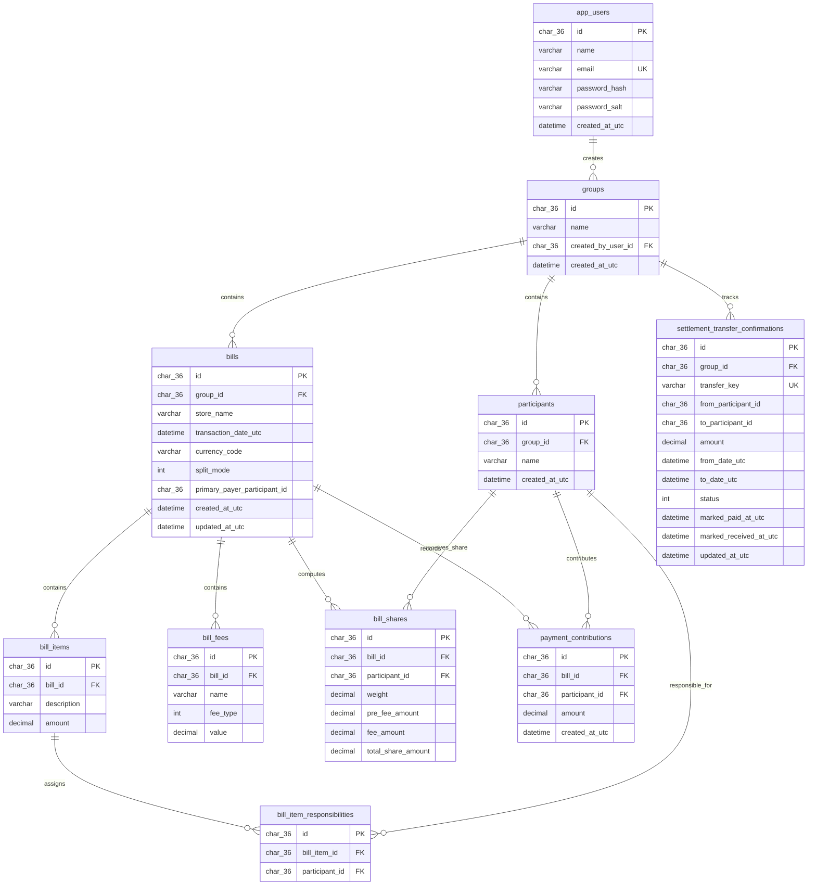

# Splity MySQL Database Flow

This schema supports local authentication, group ownership, split-bill records, and settlement confirmation.

## Runtime flow

1. `app_users` stores local development accounts and JWT identity source.
2. `groups` optionally points to the authenticated creator.
3. `participants` belong to exactly one group.
4. `bills` belong to a group and track the primary payer plus split mode.
5. `bill_items` capture line items; `bill_item_responsibilities` stores one-or-many responsible participants per item.
6. `bill_fees`, `bill_shares`, and `payment_contributions` store computed split results and payer coverage.
7. `settlement_transfer_confirmations` records the paid/received status for transfer-plan items.
